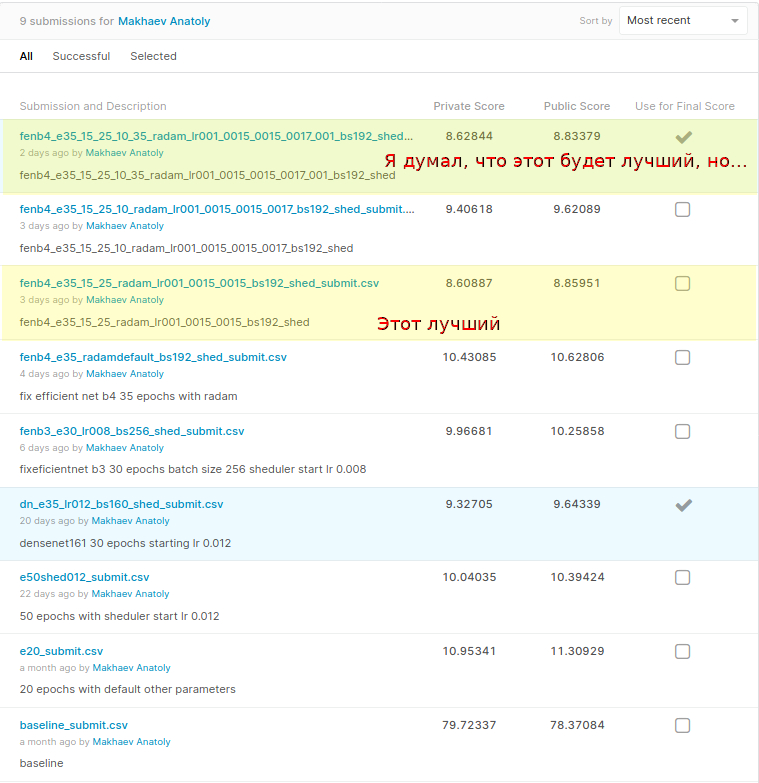

# Соревнование по поиску ключевых точек лица  

## Моё решение  
### Описание шагов
Первое, что я сделал в рамках решения задачи - запустил бейзлайн. 
Получил ожидаемый результат.  

Далее я решил попробовать обучить всё, что было в бейзлайне, но чуть подольше. 
Выучил 20 эпох без какого-либо изменения кода и танцев с бубном. 
Получил скор 11.3public/10.95private.  

В качестве следующего шага на пути к решению я добавил в код бейзлайна 
автоуменьшение скорости обучения с помощью 
torch.optim.lr_scheduler.ReduceLROnPlateau 
и поставил учиться на 50 эпох со стартовым lr 0.012. 
Получил скор 10.39public/10.04private.  

Затем я решил попробовать более интересные архитектуры. 
Выбрал densenet-161 как экономную к вычислительным ресурсам. 
Обучил её 35(на самом деле достаточно было и 25-30) эпох со стартовым 
lr 0.012 и размером батча 160. Довольно быстро получил неплохие 
результаты 9.64public/9.32private. Мне понравился densenet. 
Он хорошо, стабильно учился. Я думаю, с ним можно достичь очень хороших 
результатов. В конце выполнения задания я хотел к нему вернуться, но не успел.  

Но затем я взял ещё более интересную архитектуру. FixEfficientNet. 
Она, на мой взгляд, довольно труднообучаема, чувствительна к величине lr 
и других показателей. Но меня привлекло, что при маленьком размере и экономном 
расходовании ресурсов, она может давать неплохие результаты. 
В моей версии pytorch не оказалось реализованных FixEfficientNet, поэтому я 
доставил их отдельным пакетом: https://github.com/lukemelas/EfficientNet-PyTorch  
Несколько дней я учился её учить. 
И получил первые результаты на маленьком варианте сети FixEfficientNet-B3. 
Выучил 30 эпох с размером батча 256 и стартовым lr 0.008. 
Получил скор 10.25public/9.96private.  

Я почувствовал, что приноровился обучать FixEfficientNet, а так же вспомнил о 
том, что недавно преподаватель по методам оптимизации порекомендовал нам новую 
реализацию Adam'а: https://github.com/LiyuanLucasLiu/RAdam. 
Поэтому ещё немного попрактиковавшись, я добавил в код бейзлайна новый 
оптимизатор, выбрал версию сети побольше FixEfficientNet-B4 и пошёл обучать.  

Моё итоговое решение обучалось по шагам:  

* Начал со стандартного lr 0.001 35 эпох.  
* Увидел, что учится медленно, но стабильно и увеличил lr до 0.0015. 
Дообучил ещё 15 эпох. И ещё 25 эпох.  
* Сделал сабмит, получил скор 8.85public/8.60private.  
* Увидел, что учиться стало очень медленно, решил встряхнуть обучение, 
кратковременно увеличил lr до 0.0017 на 10 эпох (достаточно было и 5).  
* Доучил до финального результата еще 35 эпох с lr 0.001.  
* Сделал сабмит, получил скор 8.83public/8.62private.  
* Остался доволен  

### Чего я не сделал?  
* Работа с данными  
Я не работал с данными совсем. Думаю, это могло неплохо улучшить результаты, 
но требовало много времени. Данные чужие, неизвестной природы, их ооочень много, 
поэтому хоть я и не получил практику работы с данными, я не сильно грущу.  
* Была идея попробовать ансамбли моделей, не успел попробовать.  
* Было желание попробовать кастомные лоссы или регуляризации, но не успел/не смог.  

### Как воспроизвести решение?
#### Установить зависимости  
```
pip install --upgrade efficientnet-pytorch

git clone "https://github.com/LiyuanLucasLiu/RAdam.git"
cd ./RAdam
python3 ./setup.py install
cd ../
```

#### Выполнить все шаги обучения  
```
datapath="/content/data"

solvname="fenb4_e35_radam_lr001_bs192_shed"
python hack_train.py --name $solvname --data $datapath --gpu --batch-size 192 --epochs 35 --learning-rate 0.001  

oldname="fenb4_e35_radam_lr001_bs192_shed"
solvname="fenb4_e35_15_radam_lr001_0015_bs192_shed"
python hack_train.py --name $solvname --data $datapath --gpu --batch-size 192 --epochs 15 --learning-rate 0.0015 --oldname $oldname  

oldname="fenb4_e35_15_radam_lr001_0015_bs192_shed"
solvname="fenb4_e35_15_25_radam_lr001_0015_0015_bs192_shed"
python hack_train.py --name $solvname --data $datapath --gpu --batch-size 192 --epochs 25 --learning-rate 0.0015 --oldname $oldname  

# Лучший мой сабмит уже получен можно остановиться

oldname="fenb4_e35_15_25_radam_lr001_0015_0015_bs192_shed"
solvname="fenb4_e35_15_25_10_radam_lr001_0015_0015_0017_bs192_shed"
python hack_train.py --name $solvname --data $datapath --gpu --batch-size 192 --epochs 10 --learning-rate 0.0017 --oldname $oldname  

oldname="fenb4_e35_15_25_10_radam_lr001_0015_0015_0017_bs192_shed"
solvname="fenb4_e35_15_25_10_35_radam_lr001_0015_0015_0017_001_bs192_shed"
python hack_train.py --name $solvname --data $datapath --gpu --batch-size 192 --epochs 35 --learning-rate 0.001 --oldname $oldname  

# Получили мой последний сабмит
```

#### Или воспользоваться блокнотом, содержащим этот же код
См. файл solution.ipynb  

#### А предыдущие решения?  
Мои не финальные решения можно получить аналогично, но предварительно 
раскомментировав соответствующие строки в файле hack_train.py  

## Мой результат  


## Содержимое репозитория  
* hack_train.py    
Скрипт, выполняющий обучение. 
Почти полностью написан преподавателями в качестве бейзлайна.  
Запускается так:
```python hack_train.py --name "baseline" --data "PATH_TO_DATA" [--gpu] [--oldname path_to_model_pth]```  

* hack_utils.py  
Некоторые функции из hack_train.py вынесены в этот файл. 
Почти полностью написан преподавателями в качестве бейзлайна.    

* scores.png  
Скриншот списка сабмитов с kaggle.com  

* scores_with_comments.png  
Скриншот списка сабмитов с kaggle.com с комментариями  

* hack_visualize-test-predictions.ipynb  
Блокнот с кодом для визуализации результатов. 
Полностью написан преподавателями в качестве бейзлайна.  

* dtypes_landmarks.pkl  
Список типов данных для файла landmarks.csv.  
В одном из вариантов решения использовался для сокращения потребляемой 
памяти при чтении данных.  

* fenb4_e35_15_25_10_35_radam_lr001_0015_0015_0017_001_bs192_shed_submit.csv  
Мой последний сабмит.  

* fenb4_e35_15_25_radam_lr001_0015_0015_bs192_shed_submit.csv  
Мой лучший сабмит.  

* solution.ipynb  
Блокнот, содержащий решение.  
